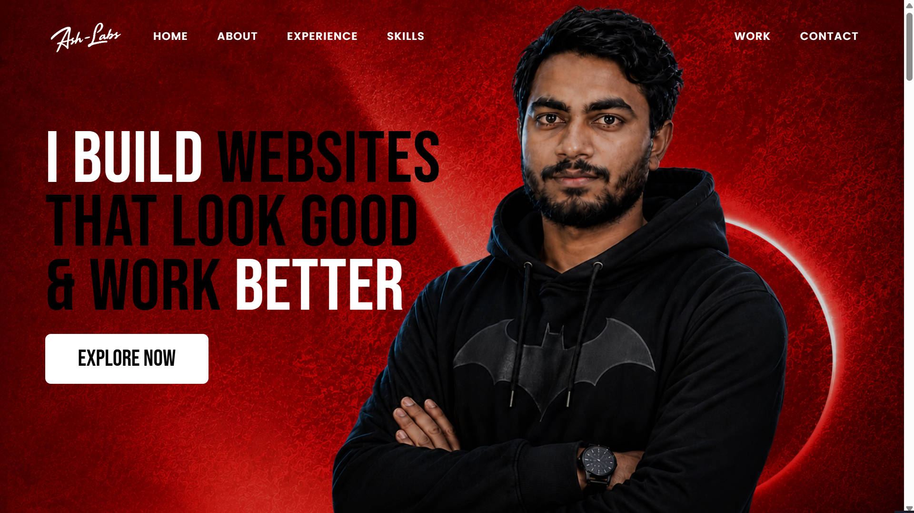
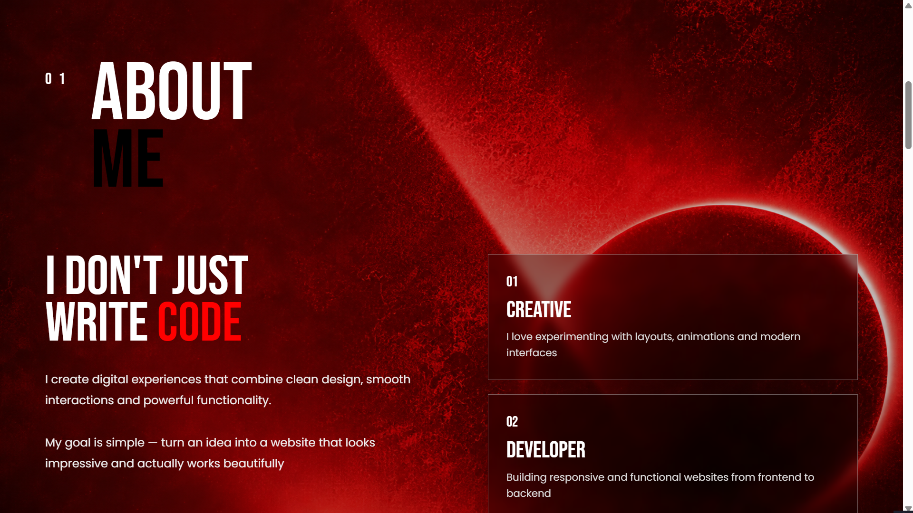
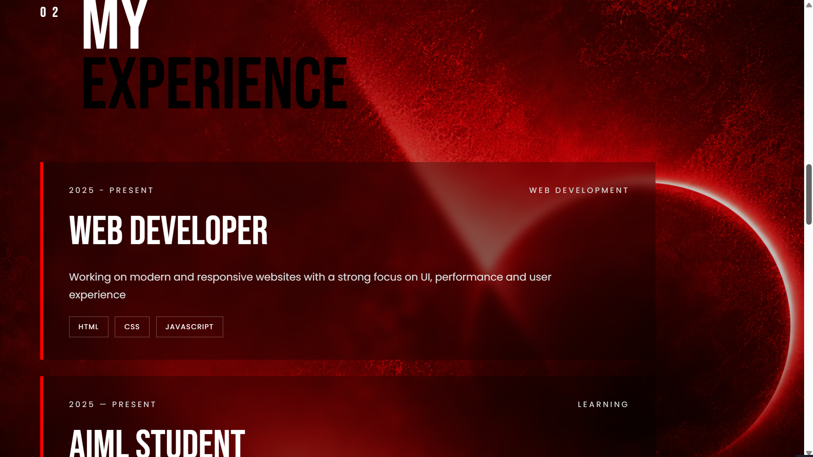
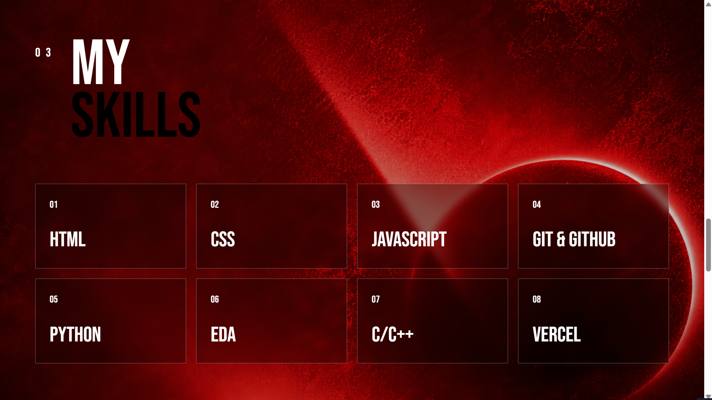
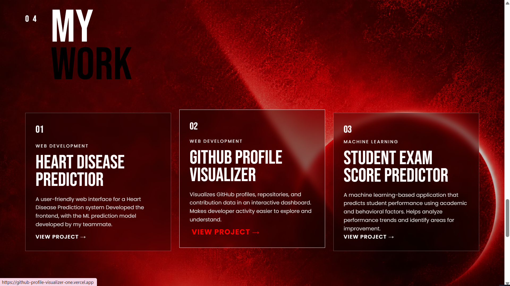
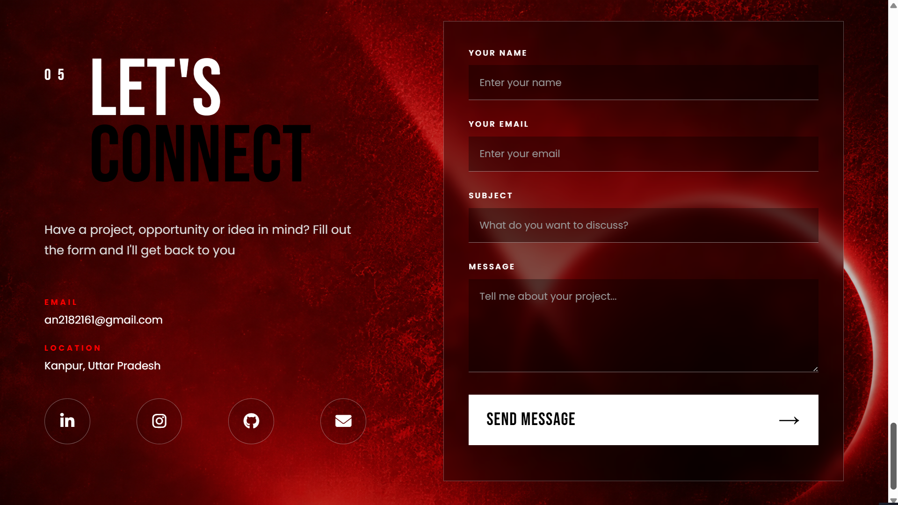

# 🚀 Ashish Portfolio

A modern and responsive personal portfolio website designed and developed to showcase my skills, experience, projects, and journey as a developer.

The portfolio features a bold visual design, smooth navigation, responsive layouts, and a clean user interface built using HTML and CSS.

---

## 🌐 Live Demo

🔗 **Visit My Portfolio:**  
[View Live Website](https://your-portfolio-link.vercel.app)

---

## 📸 Website Preview

### 🏠 Home



---

### 👨‍💻 About Me



---

### 💼 Experience



---

### 🛠️ Skills



---

### 🚀 My Work



---

### 📬 Contact



---

## ✨ Features

- Modern and bold portfolio design
- Fully responsive layout
- Smooth scrolling navigation
- Home, About, Experience, Skills, Work, and Contact sections
- Custom background images and visual effects
- Interactive buttons and project cards
- Responsive contact form
- Email functionality powered by EmailJS
- Clean and lightweight frontend structure

---

## 🛠️ Technologies Used

- HTML
- CSS
- JavaScript
- EmailJS
- Git & GitHub

---

## 📧 EmailJS Integration

This portfolio uses **EmailJS** to make the contact form functional.

EmailJS allows the website to send emails directly from the frontend without requiring a dedicated backend server.

When a visitor fills out the contact form and clicks **Send Message**, the submitted information, such as:

- Name
- Email
- Subject
- Message

is sent directly to my email using EmailJS.

This makes it possible for visitors to contact me directly through the portfolio website.

---

## 📂 Project Structure

```text
portfolio/
│
├── index.html
├── style.css
├── script.js
├── README.md
│
└── assets/
    ├── fimg.png
    ├── bg-img.png
    ├── ash-labs.png
    ├── favicon_logo.png
    │
    └── screenshots/
        ├── home.png
        ├── about.png
        ├── experience.png
        ├── skills.png
        ├── work.png
        └── contact.png
